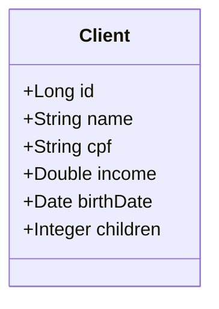

# Desafio DevSuperior - CRUD de Clientes

[](https://openjdk.org/projects/jdk/17/)
[](https://spring.io/projects/spring-boot)
[](https://hibernate.org/)
[](https://www.h2database.com/)
[](https://beanvalidation.org/)
[](https://github.com/Jacques-Trevia/desafio3-devsuperior/blob/main/LICENSE)

## 📖 Sobre o Projeto

Este repositório contém a resolução de um **desafio prático** do curso **Java Spring Professional** da DevSuperior. O objetivo é construir uma **API REST completa** para gerenciamento de clientes, consolidando os conceitos fundamentais de:

- **CRUD** (Create, Read, Update, Delete)
- **Arquitetura em camadas**: Controller, Service, Repository
- **Banco de dados relacional** com Spring Data JPA
- **Tratamento de exceções** e respostas padronizadas
- **Validação de dados** com Bean Validation
- **Paginação** de resultados

## 🎯 Objetivo do Desafio

Aprender na prática como:
- Implementar um CRUD completo com Spring Boot
- Estruturar o projeto em camadas bem definidas
- Tratar exceções de forma elegante com `@ControllerAdvice`
- Validar dados de entrada com anotações como `@NotNull`, `@Email`, `@PastOrPresent`
- Retornar respostas paginadas para listagens

## ✨ Funcionalidades

- **Listar clientes**: Paginada, com ordenação personalizável
- **Buscar cliente por ID**: Com tratamento para ID inexistente
- **Inserir novo cliente**: Com validação de campos
- **Atualizar cliente existente**: Validação e atualização parcial
- **Deletar cliente**: Com verificação de existência

## 🚀 Tecnologias Utilizadas

- **Java 17**: Linguagem de programação.
- **Spring Boot 3**: Framework principal.
- **Spring Data JPA**: Abstração para acesso a dados.
- **Hibernate**: Implementação do JPA.
- **H2 Database**: Banco de dados em memória para desenvolvimento.
- **Bean Validation**: Validação de dados com anotações.
- **Maven**: Gerenciador de dependências.

## 📁 Estrutura do Projeto
```
src/
├── main/
│ ├── java/com/jacques/desafio3/
│ │ ├── Desafio3Application.java # Classe principal
│ │ ├── controllers/ # Camada de controle
│ │ │ └── ClientController.java # Endpoints REST
│ │ ├── dto/ # Objetos de transferência
│ │ │ └── ClientDTO.java # DTO com validações
│ │ ├── entities/ # Entidades JPA
│ │ │ └── Client.java # Modelo de domínio
│ │ ├── repositories/ # Camada de acesso a dados
│ │ │ └── ClientRepository.java # Interface Spring Data
│ │ ├── services/ # Camada de negócio
│ │ │ ├── ClientService.java # Lógica de CRUD
│ │ │ └── exceptions/ # Tratamento de exceções
│ │ │ ├── DatabaseException.java # Exceção para integridade
│ │ │ ├── ResourceNotFoundException.java # Exceção para 404
│ │ │ └── ResourceExceptionHandler.java # Interceptador global
│ │ └── resources/ # Arquivos de configuração
│ └── resources/
│ ├── application.properties # Configuração do H2 e JPA
│ └── import.sql # Dados de teste iniciais
└── test/ # Testes unitários
```


## 🗺️ Modelo de Domínio



    ClientDTO --> Client : mapeamento
    
Atributos do Cliente:

Campo	Tipo	Validação
id	Long	Gerado automaticamente
name	String	@NotBlank - não pode ser vazio
cpf	String	@NotBlank - não pode ser vazio
income	Double	@Positive - deve ser positivo
birthDate	Date	@PastOrPresent - data de nascimento válida
children	Integer	@Min(0) - número de filhos >= 0

## ▶️ Como Executar o Projeto
Pré-requisitos
JDK 17 ou superior

Maven (ou utilizar o wrapper ./mvnw)

Passos
Clone o repositório:

bash
```
git clone https://github.com/Jacques-Trevia/desafio3-devsuperior.git
cd desafio3-devsuperior
```
Execute o projeto:

bash
```
./mvnw spring-boot:run
A API estará disponível em http://localhost:8080.
```
Acesse o console do H2 (opcional):
```

URL: http://localhost:8080/h2-console

JDBC URL: jdbc:h2:mem:testdb

Usuário: sa

Senha: (em branco)
```
## 🔌 Endpoints da API

Método	Endpoint	Descrição	Códigos de Resposta:
```
GET	/clients	Listar clientes paginados	200 OK
GET	/clients/{id}	Buscar cliente por ID	200 OK / 404 Not Found
POST	/clients	Inserir novo cliente	201 Created / 422 Unprocessable Entity
PUT	/clients/{id}	Atualizar cliente existente	200 OK / 404 Not Found / 422 Unprocessable Entity
DELETE	/clients/{id}	Deletar cliente	204 No Content / 404 Not Found / 400 Bad Request
```
Exemplos de Requisições

POST /clients - Criar cliente:
```
json
{
    "name": "Maria Silva",
    "cpf": "12345678901",
    "income": 6500.00,
    "birthDate": "1990-07-20",
    "children": 2
}
PUT /clients/1 - Atualizar cliente:
```
```
json
{
    "name": "Maria Silva Santos",
    "cpf": "12345678901",
    "income": 7000.00,
    "birthDate": "1990-07-20",
    "children": 2
}
```
```
GET /clients?page=0&size=10&sort=name,asc - Listar com paginação:

json
{
    "content": [...],
    "totalElements": 25,
    "totalPages": 3,
    "size": 10,
    "page": 0
}
````
## 🧪 Tratamento de Exceções
A aplicação possui um tratamento global de exceções com respostas padronizadas:

Exceção	Status	Quando ocorre
```
ResourceNotFoundException	404 Not Found	ID não encontrado na busca ou atualização
DatabaseException	400 Bad Request	Violação de integridade referencial ao deletar
MethodArgumentNotValidException	422 Unprocessable Entity	Dados inválidos na validação de entrada
```
Exemplo de resposta de erro (422):

```
json
{
    "timestamp": "2025-01-25T10:30:00Z",
    "status": 422,
    "error": "Unprocessable Entity",
    "message": "Validation error",
    "path": "/clients",
    "errors": [
        {"field": "name", "message": "Nome não pode estar em branco"},
        {"field": "birthDate", "message": "Data de nascimento deve ser passada ou presente"}
    ]
}
```
## 📦 População Inicial de Dados
O arquivo import.sql insere dados de exemplo automaticamente na inicialização:

sql
```
INSERT INTO tb_client (name, cpf, income, birth_date, children) 
VALUES ('João Silva', '12345678901', 5000.0, '1985-05-15', 2);
INSERT INTO tb_client (name, cpf, income, birth_date, children) 
VALUES ('Maria Santos', '98765432109', 7500.0, '1990-07-20', 1);
```
## 📚 Aprendizados
Este desafio permitiu praticar:

✅ Implementação de um CRUD completo com Spring Boot

✅ Organização do código em camadas (Controller, Service, Repository)

✅ Uso de DTOs para transferência de dados

✅ Tratamento global de exceções com @ControllerAdvice

✅ Validação de dados com Bean Validation (@NotBlank, @PastOrPresent, etc.)

✅ Paginação e ordenação com Spring Data JPA

✅ População inicial de dados com import.sql

## 📜 Licença

Este projeto é parte do curso da **DevSuperior** e tem propósito educacional.

---

## 👨‍💻 Autor

**Jacques Araujo Trevia Filho**

[](https://www.linkedin.com/in/jacques-trevia)
[](https://github.com/Jacques-Trevia)
